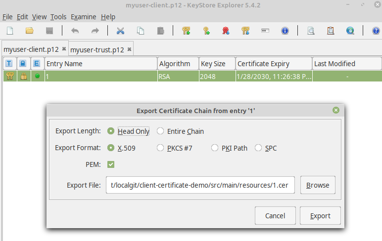
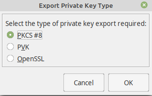
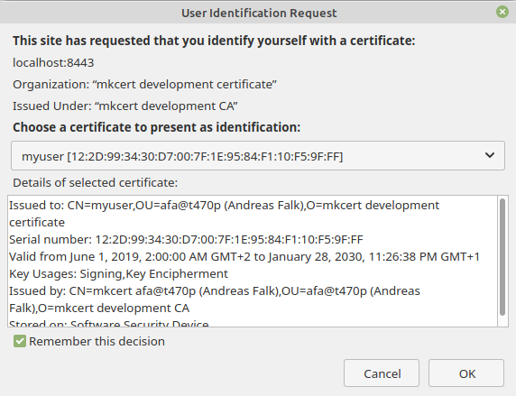
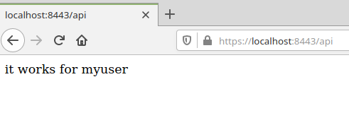
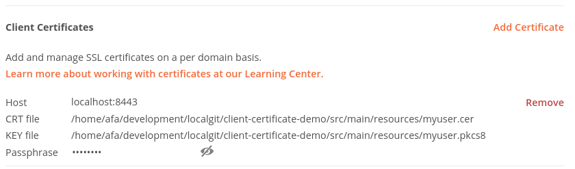
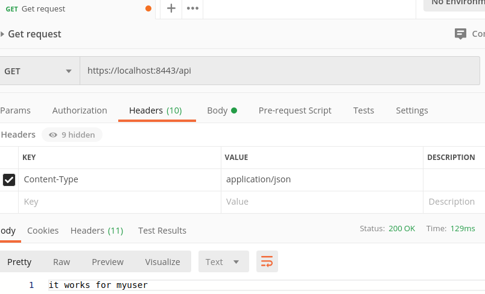

# Client Certificate Authentication with Spring Boot

This repository contains a demo on how to implement mutual TLS (_MTLS_) using Spring Boot and Spring Security.
For demonstration purposes the included application implements a simple Spring MVC Rest API:

* The app is connecting using an HTTPS connection (server authenticates to the client)
* It requires a client certificate to authenticate (client authenticates to the server)

The Rest API provides just one endpoint: ```https://localhost:8443/api``` 
that returns the value ```it works for [current_user]``` with _current_user_ being replaced by the
user specified as part of the client certificate.

## System Requirements

For this tutorial you need the following requirements:

* Java JDK version 11 or newer. Just grab it from [AdoptJDK](https://adoptopenjdk.net/?variant=openjdk11&jvmVariant=hotspot).
* Use a Java IDE of your choice (Just import the repository as a [gradle](https://gradle.org/) project)
* [mkcert](https://mkcert.dev/) to create trusted certificates for localhost. Please follow 
  the [installation instructions](https://github.com/FiloSottile/mkcert#installation) to set this up
  on your machine.
* [Keystore Explorer](https://keystore-explorer.org/) to manage keystore contents. To install it just 
  go to the [Keystore Downloads](https://keystore-explorer.org/downloads.html) page and get the appropriate
  installer for your operating system  
* [Curl](https://curl.haxx.se/) or [Postman](https://www.postman.com/) to access the 
server api using a command line or UI client. 
  
## Getting started

To create a local certificate authority (with your own root certificate)
use the following command. Make sure you also have set the _JAVA_HOME_ environment variable if you also want 
to install the root certificate into the trust store of your JDK. You have to repeat this step for each Java JDK you want
to use. 

```shell script
export JAVA_HOME=...
mkcert -install
```

This should give a similar output to this (please note that in this case _mkcert -install_ has been executed before, 
so the root certificate has already been installed in the system and the web browsers, so it was just installed for Java).

```shell script
Using the local CA at "/home/afa/.local/share/mkcert" ✨
The local CA is already installed in the system trust store! 👍
The local CA is already installed in the Firefox and/or Chrome/Chromium trust store! 👍
The local CA is now installed in Java's trust store! ☕️
```

## Setup HTTPS (SSL/TLS) for the application

At first you need a valid trusted server certificate.  
To create a keystore containing the certificate with private/public key pair 
open a command line terminal then navigate to the subdirectory _src/main/resources_ of this project 
and use the following command.

```shell script
mkcert -p12-file server-keystore.p12 -pkcs12 localhost mydev.local
```

Now you should have created a new file _server-keystore.p12_ in the subdirectory _src/main/resources_.

To enable SSL/TLS in the spring boot application add the following entries to the application.properties

```properties
server.port=8443
server.ssl.enabled=true
server.ssl.key-store=classpath:server-keystore.p12
server.ssl.key-store-type=PKCS12
server.ssl.key-store-password=changeit
server.ssl.key-password=changeit
```


## Setup the client certificate

First we need of course again a valid trusted client certificate to authenticate 
our client at the server.
Open a command line terminal again and navigate to subdirectory _src/main/resources_ of this project
and then use the following command.

```shell script
mkcert -p12-file myuser-client.p12 -client -pkcs12 myuser
```

This file contains the client certificate including the private/public key pair.
To authenticate your web browser for our Spring Boot server application just import
the file _myuser-client.p12_ into the browsers certificate store.

This is not sufficient, the server application also needs just the certificate (with public key)
to be able to validate the client certificate.
To achieve this we also need to configure a trust keystore for Spring Boot. 
You must not use the keystore we just created because the server should not get access to the private key.

Instead, we have to create another keystore using the [Keystore Explorer](https://keystore-explorer.org/)
that only contains the certificate.

But first we have to export the certificate from the existing keystore _myuser-client.p12_:

1. Open keystore with the Keystore Explorer. Select _myuser-client.p12_ in file dialog.
2. Then right click on the single entry and select _Export/Export certificate chain_ and then export the certificate to
_src/main/resources/myuser.cer_.
   


To use the client certificate on a command line client like _httpie_ we also need the private key 
of the client certificate as well.  
Therefore, we also export the private key from the same keystore _myuser-client.p12_:

* Right click on the single entry and select _Export/Export Private Key_, select _PKCS#8_ as type and then export the 
key to _src/main/resources/myuser.pkcs8_.



## Setup the server trust store

Also the server side has to trust the client certificate. To achieve this we need to setup a 
_trust store_ for our server containing the client certificate together with the public key
to validate the client certificate specified with the client requests.

So we will now import the previously exported _myuser.cer_ certificate into a new keystore:

1. Open the explorer and then create a new keystore using the menu _File/New_. 
2. Then chose _PKCS#12_ as type
3. Now select the menu _Tools/Import Trusted Certificate_
4. Select the exported _myuser.cer_ file from previous section
5. Save the keystore as _src/main/resources/myuser-trust.p12_ and use password _changeit_ when prompted for

Make sure you __ONLY__ import the certificate (containing the public key), the private key __MUST__ remain 
on the client side only. 

Now let's use this new trust store:

```properties
server.ssl.trust-store=classpath:myuser-trust.p12
server.ssl.trust-store-password=changeit
server.ssl.client-auth=need
```

We need the trust store to enable trust between the server application and the client certificate in the web browser.
The property _client_auth_ specifies how mandatory the client certificate authentication is.
Possible values for this property are:

* __need__: The client certificate is mandatory for authentication
* __want__: The client certificate is requested but not mandatory for authentication
* __none__: The client certificate is not used at all

As final step we have to configure X509 client authentication 
in _com.example.certificate.demo.security.WebSecurityConfiguration.java_:

```java
package com.example.certificate.demo.security;

import org.springframework.boot.actuate.autoconfigure.security.servlet.EndpointRequest;
import org.springframework.boot.actuate.health.HealthEndpoint;
import org.springframework.boot.actuate.info.InfoEndpoint;
import org.springframework.context.annotation.Bean;
import org.springframework.security.config.annotation.web.builders.HttpSecurity;
import org.springframework.security.config.annotation.web.configuration.EnableWebSecurity;
import org.springframework.security.config.annotation.web.configuration.WebSecurityConfigurerAdapter;
import org.springframework.security.config.annotation.web.configurers.AbstractHttpConfigurer;
import org.springframework.security.config.annotation.web.configurers.HeadersConfigurer;
import org.springframework.security.config.http.SessionCreationPolicy;
import org.springframework.security.core.userdetails.UserDetailsService;
import org.springframework.security.crypto.factory.PasswordEncoderFactories;
import org.springframework.security.crypto.password.PasswordEncoder;

@EnableWebSecurity
public class WebSecurityConfiguration extends WebSecurityConfigurerAdapter {

  @Bean
  public PasswordEncoder passwordEncoder() {
    return PasswordEncoderFactories.createDelegatingPasswordEncoder();
  }

  @Bean
  public UserDetailsService userDetailsService() {
    return new DemoUserDetailsService(passwordEncoder());
  }

  @Override
  protected void configure(HttpSecurity http) throws Exception {
    http.authorizeRequests(
            ar -> {
              ar.requestMatchers(
                      EndpointRequest.to(HealthEndpoint.class),
                      EndpointRequest.to(InfoEndpoint.class))
                  .permitAll();
              ar.requestMatchers(EndpointRequest.toAnyEndpoint()).authenticated();
              ar.anyRequest().authenticated();
            })
        .headers(h -> h.httpStrictTransportSecurity(HeadersConfigurer.HstsConfig::disable))
        .csrf(AbstractHttpConfigurer::disable)
        .sessionManagement(s -> s.sessionCreationPolicy(SessionCreationPolicy.STATELESS))
        .x509(
            x -> {
              x.subjectPrincipalRegex("CN=(.*?),");
              x.userDetailsService(userDetailsService());
            });
  }
}
```

The changes above 

* introduce a reference to the _UserDetailsService_ required for the X509 authentication
* disable the Http strict transport security header (do not disable this on production, for localhost this can be a problem for testing other
local web applications not providing a Https connection)
* configure how to get the principle from the client certificate using a regular expression for the common name (CN)

In the referenced class _com.example.certificate.demo.security.DemoUserDetailsService_ we just map
the user data from the certificate to local user entity (implementing the interface _org.springframework.security.core.userdetails.UserDetails_). 

```java
package com.example.certificate.demo.security;

import org.slf4j.Logger;
import org.slf4j.LoggerFactory;
import org.springframework.security.core.userdetails.User;
import org.springframework.security.core.userdetails.UserDetails;
import org.springframework.security.core.userdetails.UserDetailsService;
import org.springframework.security.core.userdetails.UsernameNotFoundException;
import org.springframework.security.crypto.password.PasswordEncoder;

public class DemoUserDetailsService implements UserDetailsService {
  private static final Logger LOGGER = LoggerFactory.getLogger(DemoUserDetailsService.class);

  private final PasswordEncoder passwordEncoder;

  public DemoUserDetailsService(PasswordEncoder passwordEncoder) {
    this.passwordEncoder = passwordEncoder;
  }

  @Override
  public UserDetails loadUserByUsername(String username) throws UsernameNotFoundException {

    LOGGER.debug("Got username {}", username);

    if ("myuser".equals(username)) {
      return User.withUsername("myuser")
          .passwordEncoder(passwordEncoder::encode)
          .password("none")
          .roles("USER")
          .build();
    } else {
      throw new UsernameNotFoundException(String.format("No user found for %s", username));
    }
  }
}
```

With these changes we can now also use the authenticated user in the 
class _com.example.certificate.demo.web.DemoRestController_ to show this in the result:

```java
package com.example.certificate.demo.web;

import org.springframework.security.core.annotation.AuthenticationPrincipal;
import org.springframework.security.core.userdetails.User;
import org.springframework.web.bind.annotation.GetMapping;
import org.springframework.web.bind.annotation.RequestMapping;
import org.springframework.web.bind.annotation.ResponseStatus;
import org.springframework.web.bind.annotation.RestController;

import static org.springframework.http.HttpStatus.OK;

@RestController
@RequestMapping("/api")
public class DemoRestController {

  @ResponseStatus(OK)
  @GetMapping
  public String api(@AuthenticationPrincipal User user) {
    return "it works for " + user.getUsername();
  }
}
```

That's it, the server implementation is complete.

To build the server with [gradle](https://gradle.org/) just open a shell and perform the command ```gradlew clean build```.
Please note that there this project also integrates the [OWASP Dependency Check](https://jeremylong.github.io/DependencyCheck/) 
to scan 3rd party libraries for security vulnerabilities. To perform this check just 
perform a ```gradlew dependencyCheckUpdate dependencyCheckAnalyze```. 

To start the application use [gradle](https://gradle.org/) with the command ```gradlew bootRun``` or start it using your Java IDE.

### Client Test

#### Web Browser

To authenticate your web browser for our Spring Boot server application make sure you have imported
the file _myuser-client.p12_ into your the browsers certificate store.

If you navigate your browser to ```https://localhost:8443/api``` then you first should see
a popup window requesting a client certificate. Depending on your browser configuration
you might have multiple client certificates installed. Make sure you select the one for _myuser_. 



If the authentication with the selected client certificate succeeds then you should see the output
for the Rest API call (please also note that this is also served over a secure HTTPS connection validated by 
our local CA root certificate).



#### Postman

If you are more into UI based tools then you can use [postman](https://www.postman.com) to send requests to the server.
Unfortunately postman does not work with self signed certificates with ssl validation turned on.
So open the settings (Menu _File/Settings_), in the _General_ tab deactivate _SSL certificate verification_.

To add the required files for the client certificate authentication just switch to the tab _Certificates_ in the _settings_ dialog.



Specify the following settings here:

* Host: localhost:8443
* CRT file: myuser.cer
* KEY file: myuser.pkcs8
* Passphrase: changeit   

Important Notice: Due to a current issue in newer versions of postman you might get this error (see also [issue details](https://github.com/postmanlabs/postman-app-support/issues/8612)):

```PKCS8 routines:OPENSSL_internal:UNKNOWN_ALGORITHM```

To solve this, please use only postman versions up to version _7.25.0_.

Now you can add a new request as shown in the next picture.



Click the _Send_ button to perform the request. Then you should see the expected output.

#### Curl

[Curl](https://curl.haxx.se/) can be configured to connect via a valid secure HTTPS connection and also
authenticating using the client certificate.

Before trying this please make sure that you have imported the CA certificate into the CA store of your operating system
using _mkcert_.

The most easy way for curl to use client certificates is to specify a keystore stored in _PKCS #12_ format.
This way you can hand over the certificate together with the private key to curl at once. In addition to this you need
to specify the password to access the keystore and the private key.

Check out this command for performing access via _curl_:  

```shell script
curl --cert ./src/main/resources/myuser-client.p12:changeit --cert-type p12 -v  https://localhost:8443/api
```

You may also specify the client certificate and the private key separately:

```shell script
curl --cert ./src/main/resources/myuser.cer --cert-type pem --key ./src/main/resources/myuser.pkcs8 --pass changeit  -v  https://localhost:8443/api
```

This should lead to the following output:

```shell script
* SSL connection using TLSv1.3 / TLS_AES_256_GCM_SHA384
* ALPN, server did not agree to a protocol
* Server certificate:
*  subject: O=mkcert development certificate; OU=afa@t470p (Andreas Falk); CN=localhost
*  start date: Jun  1 00:00:00 2019 GMT
*  expire date: Jan 28 22:12:05 2030 GMT
*  subjectAltName: host "localhost" matched cert's "localhost"
*  issuer: O=mkcert development CA; OU=afa@t470p (Andreas Falk); CN=mkcert afa@t470p (Andreas Falk)
*  SSL certificate verify ok.
* TLSv1.3 (OUT), TLS Unknown, Unknown (23):
> GET /api HTTP/1.1
> Host: localhost:8443
> User-Agent: curl/7.58.0
> Accept: */*
> 
* TLSv1.3 (IN), TLS Unknown, Certificate Status (22):
* TLSv1.3 (IN), TLS handshake, Newsession Ticket (4):
* TLSv1.3 (IN), TLS Unknown, Unknown (23):
< HTTP/1.1 200 
< X-Content-Type-Options: nosniff
< X-XSS-Protection: 1; mode=block
< Cache-Control: no-cache, no-store, max-age=0, must-revalidate
< Pragma: no-cache
< Expires: 0
< X-Frame-Options: DENY
< Content-Type: text/plain;charset=UTF-8
< Content-Length: 19
< Date: Mon, 23 Mar 2020 20:30:53 GMT
< 
* Connection #0 to host localhost left intact
it works for myuser% 
```

### Server-Side Output

To see that the client certificate authentication is really happening on the server side
you can enable logging for spring security X509 authentication on debug level.

_application.properties_

```properties
logging.level.org.springframework.security.web.authentication.preauth.x509=debug
```

After triggering the Rest API via web browser or command line client request you should see details for the
client certificate in the console log:

```shell script
...w.a.p.x.SubjectDnX509PrincipalExtractor : Subject DN is 'CN=myuser, OU=afa@t470p (Andreas Falk), O=mkcert development certificate'
...w.a.p.x.SubjectDnX509PrincipalExtractor : Extracted Principal name is 'myuser'
...o.s.s.w.a.p.x.X509AuthenticationFilter   : X.509 client authentication certificate:[
[
  Version: V3
  Subject: CN=myuser, OU=afa@t470p (Andreas Falk), O=mkcert development certificate
  Signature Algorithm: SHA256withRSA, OID = 1.2.840.113549.1.1.11

  Key:  Sun RSA public key, 2048 bits
  params: null
  modulus: 23253368369848628032893630278772264357078496203018563672085954387826633745536129136649857313719221974767106491857916975819815825901153301887027528238273184100205324281565555173315546049966762048884772732825147885908561417294518669035595678580994138780080507294901720363402887847773305716536408456309527091057847342087496422569307696913977686291755773504037157614914770645759676471925053015098400150869894291252915050242790869713944867413401612480099547989566114401380699576931969698381639431869952458115090562964827206337756791305720687381987297343244586956216230885030841702533261018552511490919859679491601896236721
  public exponent: 65537
  Validity: [From: Sat Jun 01 02:00:00 CEST 2019,
               To: Mon Jan 28 23:26:38 CET 2030]
  Issuer: CN=mkcert afa@t470p (Andreas Falk), OU=afa@t470p (Andreas Falk), O=mkcert development CA
  SerialNumber: [    122d9934 30d7007f 1e9584f1 10f59fff]
...
```

### Reference Documentation
For further reference, please consider the following sections:

* [mkcert (simple tool for making locally-trusted development certificates)](https://github.com/FiloSottile/mkcert)
* [Spring Boot Security Features](https://docs.spring.io/spring-boot/docs/2.2.4.RELEASE/reference/htmlsingle/#boot-features-security)
* [Spring Security X509 Authentication (Servlet Stack)](https://docs.spring.io/spring-security/site/docs/5.3.0.RELEASE/reference/html5/#servlet-x509)
* [Spring Security X509 Authentication (WebFlux Stack)](https://docs.spring.io/spring-security/site/docs/5.3.0.RELEASE/reference/html5/#reactive-x509)
* [The magic of TLS, X509 and mutual authentication explained (medium.com)](https://medium.com/sitewards/the-magic-of-tls-x509-and-mutual-authentication-explained-b2162dec4401)
* [SSL/TLS and PKI History](https://www.feistyduck.com/ssl-tls-and-pki-history/)
* [RFC 8446: The Transport Layer Security (TLS) Protocol Version 1.3](https://tools.ietf.org/html/rfc8446)
* [RFC 5280: Internet X.509 Public Key Infrastructure Certificate and Certificate Revocation List (CRL) Profile](https://tools.ietf.org/html/rfc5280)
